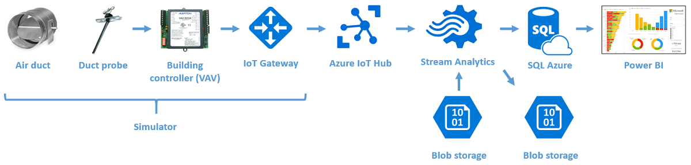
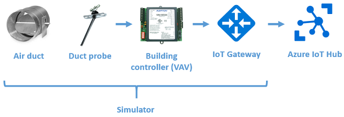
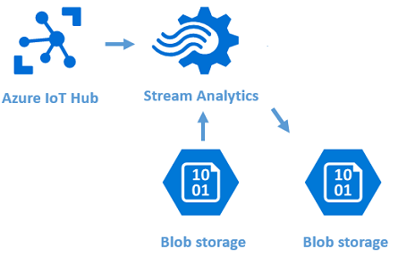
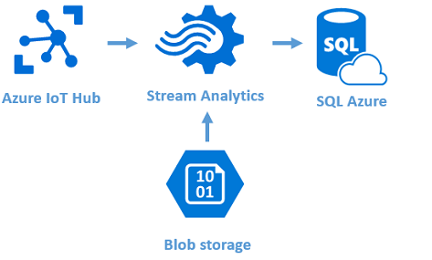
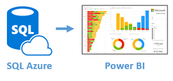

# TR24 Smart Spaces Hands-on Lab 

Welcome to the TR24 Smart Spaces Hands-on Lab ! 

We put together this workshop to help you understand the basic constructs of a Building Management 
System using only Microsoft technologies. You will build an end-to-end solution that pushes data 
from one or more simulated building sensors to Azure and then runs some basic data processing and 
analytics on that data, in the hope that this will give you a clearer understanding of what commercial 
BMSs like ICONICS do. The working solution is NOT meant to be a replacement for an enterprise BMS, but only 
a Proof of Concept.

## Assumptions and Prerequisites
In order to complete this lab without seriously struggling, you need to have a good understanding of Microsoft Azure. Specifically, you 
should have done each of the following more than a few times:

* Used http://portal.azure.com
* Created an IoT Hub or Event Hub
* Used Device Explorer or other tool to view data coming into IoT Hub
* Created an Azure Stream Analytics job
* Created and used Azure blob storage
* Created tables, views, and stored procedures in SQL Azure

An optional component of this lab uses Visual Studio to compile and run a program. A workshop 
participant wishing to do this part of the lab needs to have the following installed on his/her laptop:

* Git Shell or Git for Windows 
* Visual Studio 2013 or later

A participant doing this part of the lab would also need familiarity with:

* Accessing http://GitHub.com 
* Using Visual Studio to build and run a Project

## Getting Started
Each workshop participant has been provided access to the Azure subscription for the lab, and will be 
building assets in that subscription. In addition, we have already created some objects that every participant 
will be using. Here are the names you need to know:

> Azure subscription ID:  
> IoT Hub: TR24SmartBuildingHub  
> SQL Database: TR24SmartBuildingDB  
> Azure blob storage account: 
> Device map file:

Whenever you encounter an instruction in the lab to create something, you should preface
the name of the object you are creating with your initials. For example, if your initials are `SSS` and are asked to create 
an Azure Stream Analytics job called `{Init}LogAllEvents` you would create a job with the 
name `SSSLogAllEvents`. 

Here is a picture of this step in the end-to-end solution:

&nbsp;&nbsp;&nbsp;&nbsp;&nbsp;&nbsp;&nbsp;

In this workshop we will build this end-to-end solution in stages.

## Exercise 1: Load a device simulator
Here is a picture of this step in the end-to-end solution:

&nbsp;&nbsp;&nbsp;&nbsp;&nbsp;&nbsp;&nbsp;

Please follow these steps:

1. Logged into your laptop using your Microsoft credentials, access the private Smart Building repository on the [Azure-Samples website](https://github.com/Azure-Samples/services-iot-hub-dotnet-smartbuilding). Either download `SmartBuildingSimulatorBinaries.zip` from the `/Simulator/binaries` folder and unzip it, or, optionally, use Git to clone the entire project to your laptop and build SimulatedSensors.Windows.sln using Visual Studio.
2. Read through the [readme.md](https://github.com/Azure-Samples/services-iot-hub-dotnet-smartbuilding/blob/master/Simulator/readme.md) file to get an understanding of what the Simulator does.
2. Launch `SimulatedSensors.Windows.exe` and follow the steps in the `readme.md` file to 
    - Get the connection string for TR24SmartBuildingHub
    - Get the connection string for TR24SmartBuildingDB
    - Find a DeviceId registered in the IoT Hub
    - Enter data into the simulator text fields
    - Send data and verify it is being received by the IoT Hub

    When prompted to enter data in the Simulator, use the following: 

    - **IoT Connnection String**: {TR24SmartBuildingHub Connection String} 
    - **SQL Connection String**: {TR24SmartBuildingDB Connection String} 
    - **GatewayName**: Select {Init}GatewayName from the drop-down list of available GatewayNames 
    - **DeviceName**: Select from drop-down list 
    - **ObjectType**: Select from drop-down list  
    - **Instance**: Select from drop-down list  

    You have successfully completed this exercise if and only if the data that you see being transmitted from the Simulator is included in the data you see being received in Device Explorer. Bear in mind that the data from all
    the other workshop participants is also being received by the same IoT Hub, so you will need to watch carefully for your data.

*Estimated time to complete: 15 minutes*

## Exercise 2: Create an Azure Stream Analytics job
Here is a picture of this step in the end-to-end solution:

&nbsp;&nbsp;&nbsp;&nbsp;&nbsp;&nbsp;&nbsp;

Please follow these steps:

1. Create an Azure Stream Analytics job to push all the data received from IoT hub for your Simulator to a blob in the container TR24SS, and download the output blob to verify that you have
correctly captured only the data from your Simulator.
2. Download and open BACmap.csv to view the reference data that you need to join with the streaming device data in IoT Hub.
3. Follow the steps in the [readme.md](https://github.com/Azure-Samples/services-iot-hub-dotnet-smartbuilding/blob/master/Azure/StreamAnalytics/readme.md) file in the Azure/StreamAnalytics folder of the Azure-Samples website to

    - Join the data from the Simulator with the reference data in BACmap.csv. Don't forget to add a filter in the query to capture only your Simulator's data. 
    - Output the data to a blob
    - Download and open the output blob to verify that you have sent data

You have successfully completed this exercise if and only if the data that you saw in Device Explorer is represented in the output blob, but 
instead of having the BACnet addressing scheme for your simulated device, it has the physical address of the device.

*Estimated time to complete: 20 minutes*

## Exercise 3: Push the device data into an Event Historian table in SQL
Here is a picture of this step in the end-to-end solution:

&nbsp;&nbsp;&nbsp;&nbsp;&nbsp;&nbsp;&nbsp;

Please follow these steps:

1. Create the Event Historian table as dbo.{Init}EventHistorian using CREATE statement
downloaded from http://   
2. Modify the ASA job
3. Send more data from the simulator to IoT Hub
4. List records in your table

*Estimated time to complete: 10 minutes*

## Exercise 4: Send Event history to PIVOT

This lesson shows how to ...

In this step in creation of the end-to-end solution we will be working only in SQL Azure:

&nbsp;&nbsp;&nbsp;&nbsp;&nbsp;&nbsp;&nbsp;

Please follow these steps:

*Estimated time to complete: 10 minutes*

## Exercise 5: Create Fault processing processes

In this step in creation of the end-to-end solution we will again be working only in SQL Azure:

&nbsp;&nbsp;&nbsp;&nbsp;&nbsp;&nbsp;&nbsp;

Please follow these steps:

*Estimated time to complete: 10 minutes*

## Exercise 6: Create a Power BI dashboard

In this step in creation of the end-to-end solution we will again be working only in SQL Azure:

&nbsp;&nbsp;&nbsp;&nbsp;&nbsp;&nbsp;&nbsp;

Please follow these steps:

- Create a [Power BI](http://app.powerbi.com) Dashboard that visualizes your TI Sensor Tag data in creative ways.  Feel free to use any of the Power BI Custom Visuals available [here](http://visuals.powerbi.com). You can learn how to create Power BI Dashboards from a Stream Analytics Output [here](https://azure.microsoft.com/en-us/documentation/articles/stream-analytics-power-bi-dashboard/).

*Estimated time to complete: 10 minutes*

